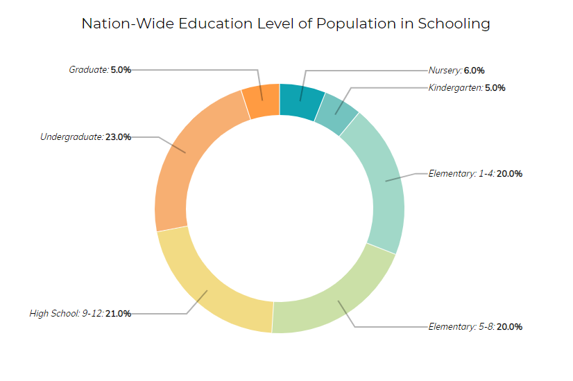
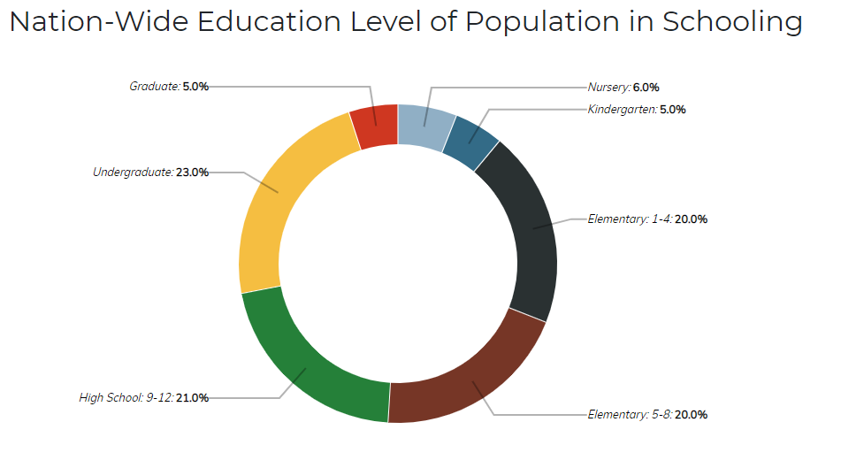

# **Οπτικοποίηση Δεδομένων (US)**

 - Ονοματεπώνυμο: **Τουλουμτζής Νικήτας**
 - Αριθμός Μητρώου: **Π2015023**
 - Link για το εκτελέσιμο της εφαρμογής: [**Εκτελέσιμο Εφαρμογής**](https://ntouloumtzis.github.io/D3js-US-educational-attainment/)
 - Link για το αποθετήριο του κώδικά μου: [**Αποθετήριο του κώδικα (Default)**](https://github.com/ntouloumtzis/D3js-US-educational-attainment/tree/gh-pages)
 - Link για το αποθετήριο του κώδικα του πρώτου παραδοτέου: [**Παραδοτέο-1**](https://github.com/ntouloumtzis/D3js-US-educational-attainment/tree/Παραδοτέο-1)
 - Link για το αποθετήριο του κώδικα του δεύτερου παραδοτέου: [**Παραδοτέο-2**](https://github.com/ntouloumtzis/D3js-US-educational-attainment/tree/Παραδοτέο-2)

## Τελική Αναφορά και τελικό έργο της εργασίας

### Σύνοψη

  Η παρούσα εργασία είναι μια παραλλαγή του πηγαίου κώδικα, όπου αναπαριστά δεδομένα με χρήση της βιβλιοθήκης D3 της Javascript. Συγκεκριμένα, αντλεί στοιχεία από αρχεία με καταλήξεις .csv, .tsv, json κ.α που εμπεριέχει δεδομένα για τη μεγάλη κατηγορία της Εκπαίδευσης, εξετάζοντας τους διάφορους πληθυσμούς και τον αριθμό των ατόμων που ανήκουν στο εκπαιδευτικό σύστημα σε κάθε επίπεδο σχολικής εκπαίδευσης από το νηπιαγωγείο έως το μεταπτυχιακό στις πολιτείες της Αμερικής. Η εργασία διεξήχθη στα πλαίσια του μαθήματος Επικοινωνία Ανθρώπου-Υπολογιστή του διδάσκοντα κ.Χωριανόπουλου για το χειμερινό εξάμηνο. Σκοπός της εργασίας είναι η εκμάθηση χρήσης τριών γλωσσών προγραμματισμού του διαδικτύου (html, css, javascript) εφαρμόζοντας τες στον παραπάνω κώδικα και κατανόηση της ισχυρής βιβλιοθήκης D3.js.

### Τεχνικές και εργαλεία

Για την υλοποίηση της εργασίας, χρησιμοποιήθηκε κατά το μεγαλύτερο ποσοστό η πλατφόρμα του Github. Σε αυτήν έγιναν η συγγραφή και οι δοκιμές του κώδικα όλων των αρχείων. Επειδή δεν γνώριζα από javascript, έπρεπε να εκμεταλευτώ την βοήθεια εκπαιδευτικών ιστοσελίδων, όπως το [**Stackoverflow**](https://stackoverflow.com/) και το [**w3schools**](https://www.w3schools.com/), όπου έτσι κατάφερα να βρω βασικά παραδείγματα και ιδέες για τη χρήση συναρτήσεων και συντακτικού και των τριών γλωσσών προγραμματισμού διαδικτύου html, css και javascript. Φυσικά, στο τέλος αναφέρονται οι ιστοσελίδες-πηγές που βοήθησαν στην ολοκλήρωση του project. Τέλος, με την χρήση του προγράμματος [**Lightshot**](https://app.prntscr.com/en/index.html) ανέβηκαν οι ενδεικτικές φωτογραφίες screenshots της αναφοράς και, τα απαραίτητα gifs με το πρόγραμμα [**ScreenToGif**](https://www.screentogif.com/).

## Παραδοτέο 1

Το πρώτο παραδοτέο βασίζεται σε 5 ζητούμενα, όπου και θα εξηγηθούν ένα-ένα παρακάτω:

 - **Ζητούμενο Πρώτο**:  _**Αλλάξτε τα χρώματα στα 3 γραφήματα.**_

  Σύνδεσμος πρώτου γραφήματος: [**script_1.js**](https://github.com/ntouloumtzis/D3js-US-educational-attainment/blob/gh-pages/assets/scripts/script_1.js)

 Κώδικας που τροποιήθηκε: 

   ```colour = d3.scaleOrdinal().range(["#90afc5", "#336b87", "#2a3132", "#763626", "#258039", "#f5be41", "#cf3721"])```

 Αποτέλεσμα του κώδικα:

   {:height="300px" width="250px"}  {:height="300px" width="250px"}


You can use the [editor on GitHub](https://github.com/ntouloumtzis/HCI-Report/edit/master/README.md) to maintain and preview the content for your website in Markdown files.

Whenever you commit to this repository, GitHub Pages will run [Jekyll](https://jekyllrb.com/) to rebuild the pages in your site, from the content in your Markdown files.

### Markdown

Markdown is a lightweight and easy-to-use syntax for styling your writing. It includes conventions for

```markdown
Syntax highlighted code block

# Header 1
## Header 2
### Header 3

- Bulleted
- List

1. Numbered
2. List

**Bold** and _Italic_ and `Code` text

[Link](url) and 
```

For more details see [GitHub Flavored Markdown](https://guides.github.com/features/mastering-markdown/).

### Jekyll Themes

Your Pages site will use the layout and styles from the Jekyll theme you have selected in your [repository settings](https://github.com/ntouloumtzis/HCI-Report/settings). The name of this theme is saved in the Jekyll `_config.yml` configuration file.

### Support or Contact

Having trouble with Pages? Check out our [documentation](https://help.github.com/categories/github-pages-basics/) or [contact support](https://github.com/contact) and we’ll help you sort it out.
