# Οπτικοποίηση Δεδομένων (US)

 - Ονοματεπώνυμο: **Τουλουμτζής Νικήτας**
 - Αριθμός Μητρώου: **Π2015023**
 - Link για το εκτελέσιμο της εφαρμογής: [Εκτελέσιμο Εφαρμογής](https://ntouloumtzis.github.io/D3js-US-educational-attainment/)
 - Link για το αποθετήριο του κώδικά μου: [Αποθετήριο του κώδικα (Default)](https://github.com/ntouloumtzis/D3js-US-educational-attainment/tree/gh-pages)
 - Link για το αποθετήριο του κώδικα του πρώτου παραδοτέου: [Παραδοτέο-1](https://github.com/ntouloumtzis/D3js-US-educational-attainment/tree/Παραδοτέο-1)
 - Link για το αποθετήριο του κώδικα του δεύτερου παραδοτέου: [Παραδοτέο-2](https://github.com/ntouloumtzis/D3js-US-educational-attainment/tree/Παραδοτέο-2)

## Τελική Αναφορά της εργασίας

### Eισαγωγή

  Η παρούσα εργασία είναι μια παραλλαγή του πηγαίου κώδικα, όπου αναπαριστά δεδομένα με χρήση της βιβλιοθήκης D3 της Javascript. Συγκεκριμένα, αντλεί στοιχεία από αρχεία με καταλήξεις .csv, .tsv, json κ.α που εμπεριέχει δεδομένα για τη μεγάλη κατηγορία της Εκπαίδευσης, εξετάζοντας τους διάφορους πληθυσμούς και τον αριθμό των ατόμων που ανήκουν στο εκπαιδευτικό σύστημα σε κάθε επίπεδο σχολικής εκπαίδευσης από το νηπιαγωγείο έως το μεταπτυχιακό στις πολιτείες της Αμερικής. Η εργασία διεξήχθη στα πλαίσια του μαθήματος Επικοινωνία Ανθρώπου-Υπολογιστή του διδάσκοντα κ.Χωριανόπουλου για το χειμερινό εξάμηνο. Σκοπός της εργασίας είναι η εκμάθηση χρήσης τριών γλωσσών προγραμματισμού του διαδικτύου (html, css, javascript) εφαρμόζοντας τες στον παραπάνω κώδικα και κατανόηση της ισχυρής βιβλιοθήκης D3.js.

### Τεχνικές και εργαλεία

Για την υλοποίηση της εργασίας, χρησιμοποιήθηκε κατά το μεγαλύτερο ποσοστό η πλατφόρμα του Github. Σε αυτήν έγιναν η συγγραφή και οι δοκιμές του κώδικα όλων των αρχείων. Επειδή δεν γνώριζα από javascript, έπρεπε να εκμεταλευτώ την βοήθεια εκπαιδευτικών ιστοσελίδων, όπως το [Stackoverflow](https://stackoverflow.com/) και το [w3schools](https://www.w3schools.com/), όπου έτσι κατάφερα να βρω βασικά παραδείγματα και ιδέες για τη χρήση συναρτήσεων και συντακτικού και των τριών γλωσσών προγραμματισμού διαδικτύου html, css και javascript. Φυσικά, στο τέλος αναφέρονται οι ιστοσελίδες-πηγές που βοήθησαν στην ολοκλήρωση του project. Τέλος, με την χρήση του προγράμματος [Lightshot](https://app.prntscr.com/en/index.html) ανέβηκαν οι ενδεικτικές φωτογραφίες screenshots της αναφοράς και, τα απαραίτητα gifs με το πρόγραμμα [ScreenToGif](https://www.screentogif.com/).

# Πρώτο Παραδοτέο

Το πρώτο παραδοτέο βασίζεται σε 5 ζητούμενα, όπου και θα εξηγηθούν ένα-ένα παρακάτω:

### 1o Ζητούμενο

 - _**Γράφημα Πρώτο**_

   **Σύνδεσμοι τροποποιημένων αρχείων:** [script_1.js](https://github.com/ntouloumtzis/D3js-US-educational-attainment/blob/gh-pages/assets/scripts/script_1.js)

 Κώδικας που τροποιήθηκε:

```
colour = d3.scaleOrdinal().range(["#90afc5", "#336b87", "#2a3132", "#763626", "#258039", "#f5be41", "#cf3721"])
```

 Αποτέλεσμα του κώδικα:

 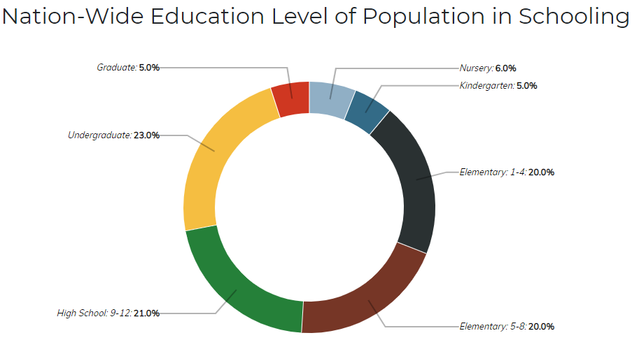
 
 - _**Γράφημα Δεύτερο**_

   **Σύνδεσμοι τροποποιημένων αρχείων:** [script_2.js](https://github.com/ntouloumtzis/D3js-US-educational-attainment/blob/gh-pages/assets/scripts/script_2.js) και [style.css](https://github.com/ntouloumtzis/D3js-US-educational-attainment/blob/gh-pages/assets/stylesheets/style.css)

 Σ'αυτό το γράφημα έγιναν αλλαγές στα:

 i. Xρώματα του **κουμπιού** _"United States of America - Click a Regin to Inspect States"_                                              
 ii. Xρώματα του ίδιου του γραφήματος

 i.a) Το default χρώμα του **κουμπιού** (**script_2.js**)

 Κώδικας που τροποποιήθηκε:

```
    46   .attr("fill", '#009933');
         ...
    90   return '#009933'
```

 Αποτέλεσμα του κώδικα:

 {:height="30px"}

 
 i.b) Όταν περνάει το ποντίκι πάνω απ'το κουμπί του γραφήματος (**style.css**)

 Κώδικας που τροποποιήθηκε:

```
    278   .grandparent:hover rect {
    279     fill: #006622;
    280   }
```

 Αποτέλεσμα του κώδικα:

 {:height="30px"}

 ii) Στο ίδιο το γράφημα

 Κώδικας που τροποποιήθηκε:

```
    14    var color = d3.scaleLinear().domain([0, 1/4*5000000, 2/4*5000000, 3/4*5000000, 5000000]).range(["#fb6542", "#ffbb00", "#375e97", "#3f681c"]);


    178   if (treeSumSortType == "number") {
    179       color = d3.scaleLinear().domain([0, 1/4*5000000, 2/4*5000000, 3/4*5000000, 5000000]).range(["#fb6542", "#ffbb00", "#375e97", "#3f681c"]);
    180       return d["Total College"];
    181   } else if (treeSumSortType == "percent") {
    182       color = d3.scaleLinear().domain([0, 1/4*50, 2/4*50, 3/4*50, 50]).range(["#fb6542", "#ffbb00", "#375e97", "#3f681c"]);
    183       return d["Percent College"];
    184   } else if (treeSumSortType == "male") {
    185       color = d3.scaleLinear().domain([0, 1/4*50, 2/4*50, 3/4*50, 50]).range(["#fb6542", "#ffbb00", "#375e97", "#3f681c"]);
    186       return d["Percent College - Male"];
    187   } else {
    188       color = d3.scaleLinear().domain([0, 1/4*50, 2/4*50, 3/4*50, 50]).range(["#fb6542", "#ffbb00", "#375e97", "#3f681c"]);
    189       return d["Percent College - Female"];
    190   }
```

 Αποτέλεσμα του κώδικα:

 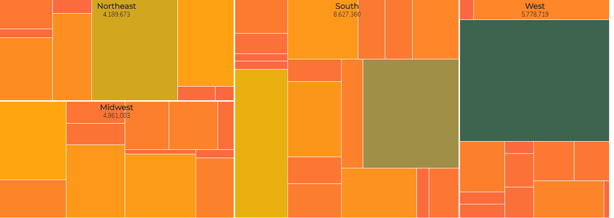


 - _**Γράφημα Τρίτο**_

   **Σύνδεσμοι τροποποιημένων αρχείων:** [script_3.js](https://github.com/ntouloumtzis/D3js-US-educational-attainment/blob/gh-pages/assets/scripts/script_3.js)

 Κώδικας που τροποποιήθηκε:

```
    14   var colors = d3.scaleOrdinal()
    15   .range(["#98abc5", "#8a89a6", "#7b6888", "#6b486b", "#a05d56", "#d0743c", "#ff8c00"]); // Picked colors
```

 Αποτέλεσμα του κώδικα:

 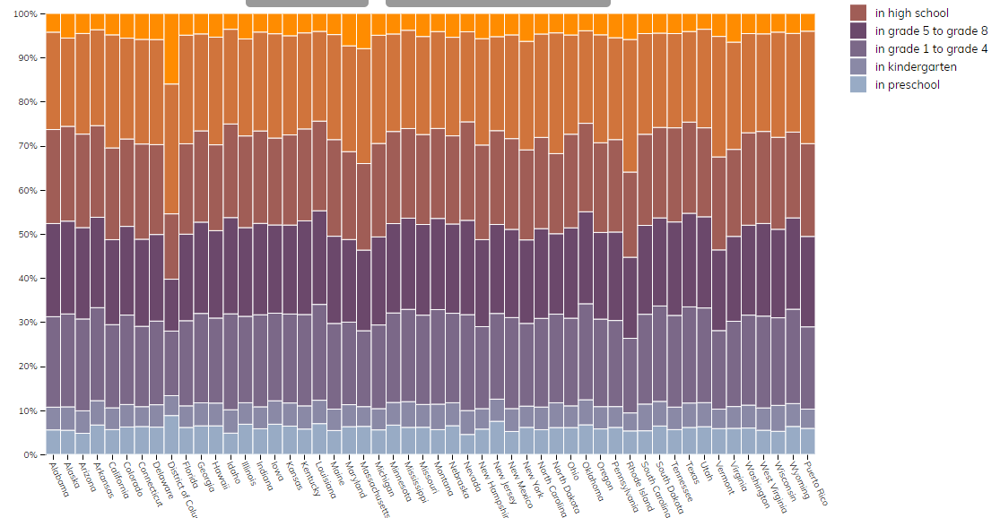


### 2o Ζητούμενο

 - **Σύνδεσμοι τροποιημένων αρχείων:** [style.css](https://github.com/ntouloumtzis/D3js-US-educational-attainment/blob/gh-pages/assets/stylesheets/style.css)

 Κώδικας που τροποιήθηκε:

```
    81   .radio-toolbar label {
    82   background-color: white; 
    83   color: black; 
    84   border: 2px outset #304040;
    85   padding: 5px 10px;
    86   text-align: center;
    87   text-decoration: none;
    88   display: inline-block;
    89   font-size: 16px;
    90   margin: 6px 8px;
    91   -webkit-transition-duration: 0.2s;
    92   transition-duration: 0.2s;
    93   cursor: pointer;
    94   ox-shadow: 0 9px #999;
    95   font-weight: bold;
    96   }
    97
    98   .radio-toolbar label:hover {
    99   background-color: #304040;
   100   color: white; 
   101   }
   102
   103   .radio-toolbar label:active {
   104   background-color: #304040;
   105   box-shadow: 0 5px #666;
   106   transform: translateY(4px);
   107   }
   108
   109   radio-toolbar input[type="radio"]:checked+label {
   110   background-color: #304040;
   111   color: white;
   112   }
```

 Αποτέλεσμα του κώδικα:

 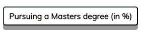


### 3o Ζητούμενο

Για να ακούγεται ήχος κάθε φορά που διέρχεται το ποντίκι στο menu της σελίδας, αρκεί να διαλέξουμε ένα ηχητικό αρχείο(κλιπ). Αρχικά, κατέβασα ένα mp3 αρχείο από το διαδίκτυο:

 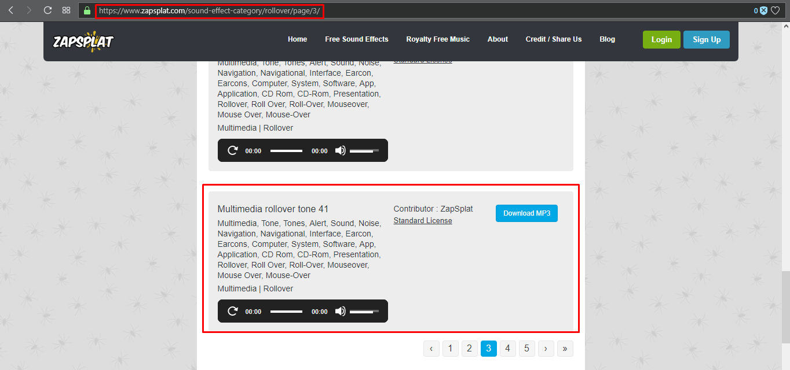

 Τέλος, ακολούθησα τα βήματα στην εικόνα της παρακάτω ιστοσελίδας

 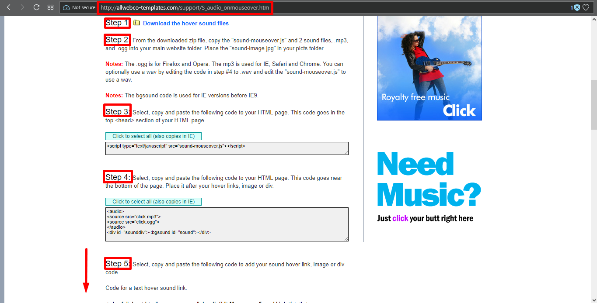

   Στην ουσία, ανέβασα δύο αρχεία του κλιπ, ένα [.mp3](https://github.com/ntouloumtzis/D3js-US-educational-attainment/blob/gh-pages/mousehover-sound.mp3) και ενα [.ogg](https://github.com/ntouloumtzis/D3js-US-educational-attainment/blob/gh-pages/mousehover-sound.ogg), για να υποστηρίζεται απ'όλους τους φυλλομετρητές.
Μετά, ανέβασα το [mousehover-sound.js](https://github.com/ntouloumtzis/D3js-US-educational-attainment/blob/gh-pages/mousehover-sound.js) αρχείο στο repository του κώδικά μου, για να υποστηρίζεται και απο τον IE φυλλομετρητή. Στη συνέχεια, τροποποίησα το αρχείο [index.html](https://github.com/ntouloumtzis/D3js-US-educational-attainment/blob/gh-pages/index.html), εισάγοντας ενα _script tag_ στο **head tag**:

```
<script type="text/javascript" src="mousehover-sound.js"></script>
```

Ενα _audio tag_ πριν το τέλος του **body tag**:

```
<audio>
<source src="mousehover-sound.mp3"></source>
<source src="mousehover-sound.ogg"></source>
</audio>
 <div id="sounddiv"><bgsound id="sound"></div>
```

καθώς και τον κώδικα

```
onmouseover="playclip();"
```

σε κάθε ένα από τα tags των επιλογών του menu μας

```
<li><a href="#top" onmouseover="playclip();" >Top</a></li>
<li><a href="#national" onmouseover="playclip();" >National</a></li>
<li><a href="#regional" onmouseover="playclip();" >Regional</a></li>
<li><a href="#state" onmouseover="playclip();" >State-Level</a></li>
```


### 4o Ζητούμενο

Για να ακούγεται η αφήγηση του κάθε κειμένου, όταν θα διέρχεται το ποντίκι πάνω, χρησιμοποιούμε τη βιβλιοθήκη **ResponsiveVoice**, σε _script tag_ στο [index.html](https://github.com/ntouloumtzis/D3js-US-educational-attainment/blob/gh-pages/index.html):

```
<script src="https://code.responsivevoice.org/responsivevoice.js"></script>
```

και την παρακάτω συνάρτηση, μέσα σε _script tag_:

```
<script>
$(document).ready(function(){
$("h1, h2, label").mouseenter(function(){
   responsiveVoice.cancel(); 
   responsiveVoice.speak($(this).text(), 'UK English Male');
});
$("h1, h2, label").mouseleave(function(){
   responsiveVoice.cancel();
   });
});
</script>
```

Μια ακόμη προσθήκη, η οποία έγινε έτσι ώστε να διευκολυθούν οι χρήστες αυτοί, είναι πως κάθε φορά που ο χρήστης κάνει hover πάνω από ένα στοιχείο του pie-chart, ακούγεται μέσω της **javascript class SpeechSynthesisUtterance**. Οι αλλαγές αυτές έγιναν στο αρχείο [script_1.js](https://github.com/ntouloumtzis/D3js-US-educational-attainment/blob/gh-pages/assets/scripts/script_1.js).

```
    Mέσα στο mouseenter: (Οι εντολές κώδικα που πρόσθεσα αρχίζουν απ'την γραμμή 155 και τελειώνουν στην 162.)
var message = new SpeechSynthesisUtterance(toolTipHTML(data));
                speechSynthesis.speak(message);

    Mέσα στο mouseout:
speechSynthesis.cancel();
```


### 5o Ζητούμενο 

Για να προσαρμόσουμε την ιστοσελίδα μας σε οθόνες διαφορετικών διαστάσεων, θα χρειαστεί να χρησιμοποιήσουμε χρήσιμες βιβλιοθήκες της Bootstrap. Αυτές που χρησιμοποίησα, είναι οι νεότερες εκδόσεις της css και js της bootstrap, της jquery και popper και εκτός απ'τις βιβλιοθήκες αυτές και ένα _meta tag_ για να έρχεται στις διαστάσεις της κάθε συσκευής.

```
<meta name="viewport" content="width=device-width, initial-scale=1">
<link rel="stylesheet" href="https://stackpath.bootstrapcdn.com/bootstrap/4.1.3/css/bootstrap.min.css" integrity="sha384-      MCw98/SFnGE8fJT3GXwEOngsV7Zt27NXFoaoApmYm81iuXoPkFOJwJ8ERdknLPMO" crossorigin="anonymous">
<script src="https://stackpath.bootstrapcdn.com/bootstrap/4.1.3/js/bootstrap.min.js" integrity="sha384ChfqqxuZUCnJSK3+MXmPNIyE6ZbWh2IMqE241rYiqJxyMiZ6OW/JmZQ5stwEULTy" crossorigin="anonymous"></script>
<script src="https://ajax.googleapis.com/ajax/libs/jquery/3.3.1/jquery.min.js"></script>
<script src="https://cdnjs.cloudflare.com/ajax/libs/popper.js/1.14.3/umd/popper.min.js" integrity="sha384ZMP7rVo3mIykV+2+9J3UJ46jBk0WLaUAdn689aCwoqbBJiSnjAK/l8WvCWPIPm49" crossorigin="anonymous"></script>
```

Στη συνέχεια, πρόσθεσα τον παρακάτω κώδικα στο αρχείο [index.html](https://github.com/ntouloumtzis/D3js-US-educational-attainment/blob/gh-pages/index.html), ώστε το **menu** της ιστοσελίδας να προσαρμόζεται σωστά σε μικρότερες συσκευές:

```
<header>
 <nav class="navbar navbar-expand-md navbar-dark bg-dark">
 	<div class="container-fluid">
 		<button class="navbar-toggler" type="button" data-toggle="collapse" data-target="#navbarResponsive">
 			<span class="navbar-toggler-icon"></span>
 		</button>
 		<div class="collapse navbar-collapse" id="navbarResponsive">
 			<ul class="navbar-nav ml-auto">
<li class="nav-item active"><a class="nav-link" href="#top" onmouseover="playclip();" >Top</a></li>
<li class="nav-item active"><a class="nav-link" href="#national" onmouseover="playclip();" onclick="FunctionGraphOne()" >National</a></li>
<li class="nav-item active"><a class="nav-link" href="#regional" onmouseover="playclip();" onclick="FunctionGraphTwo()" >Regional</a></li>
<li class="nav-item active"><a class="nav-link" href="#state" onmouseover="playclip();" onclick="FunctionGraphThree()" >State-Level</a></li>
<li class="nav-item active"><a class="nav-link" href="index2.html" onmouseover="playclip();" >Additional-Charts</a></li>                                                 
 			</ul>
 		</div>
 	</div>
 </nav>
</header>
```

Τέλος, πρόσθεσα τις παρακάτω γραμμές κώδικα στο αρχείο [style.css](https://github.com/ntouloumtzis/D3js-US-educational-attainment/blob/gh-pages/assets/stylesheets/style.css) (αντικαθιστώντας τα με τα αντίστοιχα _nav tags_ που υπήρχαν πριν), δημιουργώντας μικρές αλλαγές, αλλά και για να δουλεύει σωστά το **menu** σε μικρότερες οθόνες.

```
.navbar {
 padding: .8rem;
}

.navbar-nav li {
 padding-right: 20px;
}

.nav-link {
 font-size: 1.1em !important;
}
```

 Αποτέλεσμα του κώδικα:

 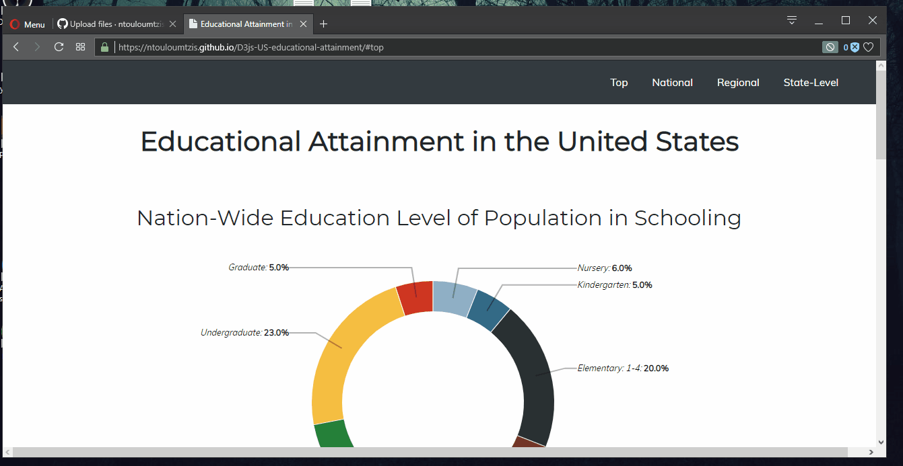


# Δεύτερo Παραδοτέο

Το δεύτερο παραδοτέο βασίζεται σε 3 ζητούμενα, όπου και θα εξηγηθούν ένα-ένα παρακάτω:

### 1ο Ζητούμενο

Για να είναι εμφανές μόνο το ένα γράφημα που επιθυμούμε να διαλέξουμε, πρόσθεσα στο [index.html](https://github.com/ntouloumtzis/D3js-US-educational-attainment/blob/gh-pages/index.html) τις παρακάτω συναρτήσεις:

```
<script>
function FunctionGraphOne() {
var x = document.getElementById("GraphOne");
var y = document.getElementById("GraphTwo");
var w = document.getElementById("GraphThree");
if (x.style.display === "none") {
    x.style.display = "block";
y.style.display = "none";
w.style.display = "none";
} else {
x.style.display = "none";
}
}

function FunctionGraphTwo() {
var x = document.getElementById("GraphOne");
var y = document.getElementById("GraphTwo");
var w = document.getElementById("GraphThree");
if (y.style.display === "none") {
    x.style.display = "none";
y.style.display = "block";
w.style.display = "none";
} else {
    y.style.display = "none";
}
}

function FunctionGraphThree() {
var x = document.getElementById("GraphOne");
var y = document.getElementById("GraphTwo");
var w = document.getElementById("GraphThree");
if (w.style.display === "none") {
    x.style.display = "none";
y.style.display = "none";
w.style.display = "block";
} else {
    w.style.display = "none";
}
}

FunctionGraphTwo();
FunctionGraphThree();
</script>
```

Οι παραπάνω συναρτήσεις θα καλούνται κάθε φορά που ο χρήστης θα πατάει μία επιλογή στο **menu**, για το επιθυμητό γράφημα που θέλει να ελέγξει. Στην ουσία πρόσθεσα στο _header tag_ του ίδιου αρχείου τις εντολές,

```
onclick="FunctionGraphOne()"
onclick="FunctionGraphTwo()"
onclick="FunctionGraphThree()"
```

αντίστοιχα για κάθε γράφημα. Τέλος, τα συνδέω με _div tags_ για το κάθε γράφημα ξεχωριστά.

```
<div id="GraphOne"> <!-- εντολές γραφήματος 1 --> </div>
<div id="GraphTwo"> <!-- εντολές γραφήματος 2 --> </div>
<div id="GraphThree"> <!-- εντολές γραφήματος 3 --> </div>
```

 Αποτέλεσμα του κώδικα:

 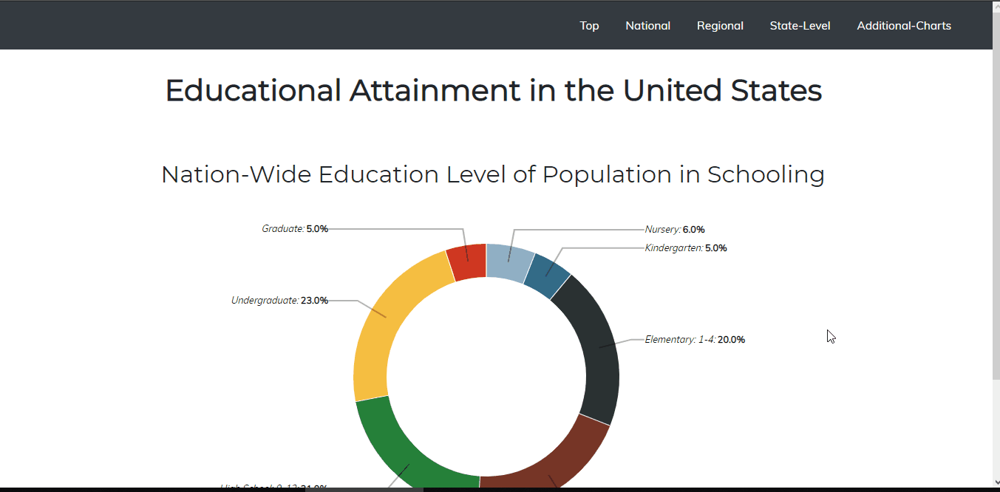


### 2o Ζητούμενo

 - _**Δεν υλοποιήθηκε**_


### 3o Ζητούμενo

- **Πηγές Στατιστικών Δεδομένων:** ([ΕΛΣΤΑΤ](http://www.statistics.gr/))
       
     - [_Μόνιμος πληθυσμός των 10 μεγαλύτερων Δήμων της Χώρας κατά Σύνολο_](http://www.statistics.gr/el/statistics?p_p_id=documents_WAR_publicationsportlet_INSTANCE_qDQ8fBKKo4lN&p_p_lifecycle=2&p_p_state=normal&p_p_mode=view&p_p_cacheability=cacheLevelPage&p_p_col_id=column-2&p_p_col_count=4&p_p_col_pos=1&_documents_WAR_publicationsportlet_INSTANCE_qDQ8fBKKo4lN_javax.faces.resource=document&_documents_WAR_publicationsportlet_INSTANCE_qDQ8fBKKo4lN_ln=downloadResources&_documents_WAR_publicationsportlet_INSTANCE_qDQ8fBKKo4lN_documentID=310596&_documents_WAR_publicationsportlet_INSTANCE_qDQ8fBKKo4lN_locale=el) 
**Πίνακας 1**
     - [_Εξέλιξη του ποσοστού ανεργίας κάθε μήνα Σεπτεμβρίου αντίστοιχα, 2004 – 2018_](http://www.statistics.gr/el/statistics?p_p_id=documents_WAR_publicationsportlet_INSTANCE_qDQ8fBKKo4lN&p_p_lifecycle=2&p_p_state=normal&p_p_mode=view&p_p_cacheability=cacheLevelPage&p_p_col_id=column-2&p_p_col_count=4&p_p_col_pos=1&_documents_WAR_publicationsportlet_INSTANCE_qDQ8fBKKo4lN_javax.faces.resource=document&_documents_WAR_publicationsportlet_INSTANCE_qDQ8fBKKo4lN_ln=downloadResources&_documents_WAR_publicationsportlet_INSTANCE_qDQ8fBKKo4lN_documentID=345824&_documents_WAR_publicationsportlet_INSTANCE_qDQ8fBKKo4lN_locale=el) **Γράφημα 1**
     - [_Ετήσια μεταβολή (%) Δεικτών Όγκου στο Λιανικό Εμπόριο Σεπτεμβρίου 2018/2017_](http://www.statistics.gr/el/statistics?p_p_id=documents_WAR_publicationsportlet_INSTANCE_qDQ8fBKKo4lN&p_p_lifecycle=2&p_p_state=normal&p_p_mode=view&p_p_cacheability=cacheLevelPage&p_p_col_id=column-2&p_p_col_count=4&p_p_col_pos=1&_documents_WAR_publicationsportlet_INSTANCE_qDQ8fBKKo4lN_javax.faces.resource=document&_documents_WAR_publicationsportlet_INSTANCE_qDQ8fBKKo4lN_ln=downloadResources&_documents_WAR_publicationsportlet_INSTANCE_qDQ8fBKKo4lN_documentID=344759&_documents_WAR_publicationsportlet_INSTANCE_qDQ8fBKKo4lN_locale=el) **Γράφημα 4**

Αρχικά, δημιουργήθηκαν 3 γραφήματα με τα αντίστοιχα στατιστικά δεδομένα τις ΕΛΣΤΑΤ, τα [script_4.js](https://github.com/ntouloumtzis/D3js-US-educational-attainment/blob/gh-pages/assets/scripts/script_4.js), [script_5.js](https://github.com/ntouloumtzis/D3js-US-educational-attainment/blob/gh-pages/assets/scripts/script_5.js) και [script_6.js](https://github.com/ntouloumtzis/D3js-US-educational-attainment/blob/gh-pages/assets/scripts/script_6.js)

 Τα δύο πρώτα τοποθετήθηκαν σε μια νέα σελίδα, την [index2.html](https://github.com/ntouloumtzis/D3js-US-educational-attainment/blob/gh-pages/index2.html), ενώ το τελευταίο γράφημα τοποθετήθηκε σε άλλη σελίδα, την [index3.html](https://github.com/ntouloumtzis/D3js-US-educational-attainment/blob/gh-pages/index3.html), γιατί δεν μου έβγαζε αλλιώς το αποτέλεσμα στην δεύτερη σελίδα.

 Αποτέλεσμα του κώδικα του πρώτου γραφήματος:

  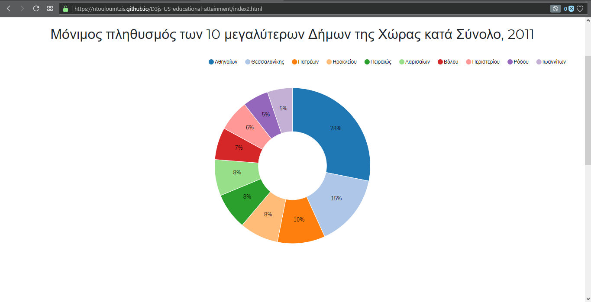

 Αποτέλεσμα του κώδικα του δεύτερου γραφήματος:

  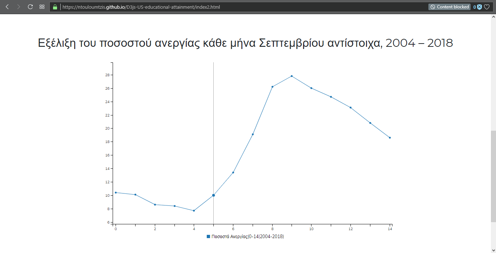

 Αποτέλεσμα του κώδικα του τρίτου γραφήματος:

  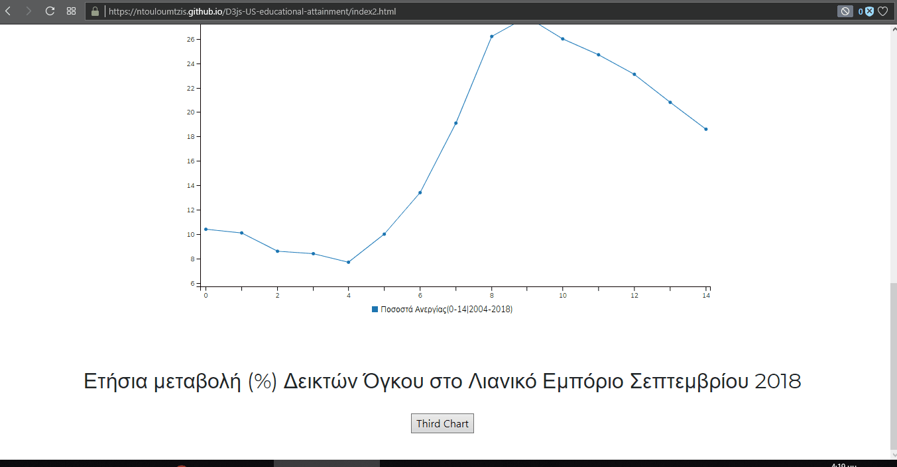


### Συμπεράσματa

Συνοψίζοντας, η παραπάνω εργασία εμβαθύνει τις γνώσεις των φοιτητών σε γλώσσες προγραμματισμού (html5, javascript, css), στη χρήση api, στη χρήση της πλατφόρμας Github και στην αναπαράσταση δεδομένων από ένα σετ δεδομένων με αρχεία τύπου json ή csv κ.α, με τη βοήθεια του ανοιχτού κώδικα (open source) της βιβλιοθήκης D3.js της Javascript. Αξιοποιώντας, λοιπόν, τα παραπάνω εργαλεία και τεχνικές, κατανοείται η δομή του προβλήματος και του κώδικα που χρειάζεται να επεξεργασθεί. Χτίζεται το κατάλληλο λογισμικό με τον καλύτερο δυνατό τρόπο, λόγω των πολυπαραμετρικών αξιοποιήσεών του. Οπότε, η τρέχουσα εργασία αποτελεί ένα σημαντικό προσανατολισμό στη σωστή αντίληψη του πεδίου της επικοινωνίας ανθρώπου-υπολογιστή. Αυτό αιτιολογείται, εφόσον φέρνει το φοιτητή αντιμέτωπο με τις απαιτήσεις υλοποίησης νέου κώδικα ή επεξεργασίας ήδη υπάρχοντος, συνεισφοράς κώδικα με άλλα άτομα σε κοινό αποθετήριο, αντικατάστασης ή τροποποίησης αρχείων. Αξίζει να σημειωθεί, πως ο φοιτητής μαθαίνει να ψάχνει και να ερευνά νέες μεθόδους και τεχνικές για τη σωστή υλοποίηση των απαιτούμενών του και τη διόρθωση στα λάθη που θα προκύψουν.

## Δικτυoγραφία 

- https://www.w3schools.com/html/
- https://www.w3schools.com/css/default.asp
- https://responsivevoice.org/
- https://www.w3schools.com/howto/howto_js_topnav_responsive.asp
- http://nvd3.org/examples/pie.html
- https://c3js.org/gettingstarted.html
- https://bl.ocks.org/mbostock/b5935342c6d21928111928401e2c8608
- http://nvd3.org/examples/discreteBar.html
